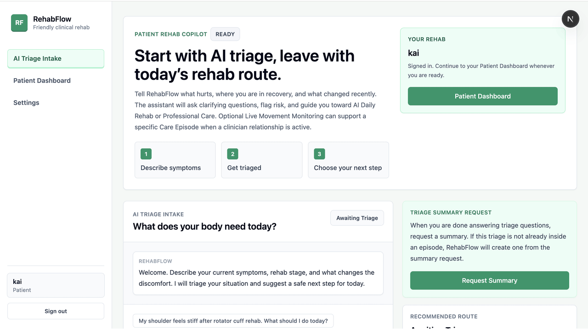

# RehabFlow

RehabFlow is an AI agent powered rehabilitation application for patient self-care
and clinician-supported recovery.

The product has three connected workflows:

- **AI Triage Intake** gathers symptoms, safety signals, goals, and missing
  context before recommending a next step.
- **AI Daily Rehab** uses database-backed exercises after the Rehab Safety Gate
  has been satisfied.
- **Professional Care** lets a patient and selected doctor share a Care
  Conversation, care plans, AI Care Summary, and optional live movement
  monitoring.



## Features

- **Care Episodes:** keep one rehabilitation concern's AI Triage Intake,
  recommendations, memory, daily rehab, Professional Care activity, history,
  and next steps together.
- **AI Triage Intake:** collect symptoms, goals, rehabilitation context, and
  warning signs; use the conversation and existing memory to understand the
  concern; and recommend the next step, including suitable rehab exercises when
  the patient is ready for self-care. Saved triage summaries also provide the
  durable context used by later episode workflows.
- **AI Daily Rehab:** turn reviewed, triage-based exercise recommendations into
  an episode-specific list. Patients can browse the database-backed Exercise
  Catalog, inspect exercise media, start guided sessions, mark exercises
  complete, add notes, and review their rehab history after the Rehab Safety Gate
  is satisfied.
- **Clarification and resume:** when information is missing, the patient sees a
  clear follow-up question and can continue the same AI session after answering.
- **Professional Care:** connect a patient and selected doctor around one Care
  Episode with a Care Conversation, care plans, AI Care Summary, and optional
  live movement monitoring.
- **Patient and doctor workspaces:** patients can review episode progress and
  memory, while doctors can work from relationship-specific care and briefing
  surfaces.

For the agent architecture, context engineering, tool
contracts, and evaluation approach, see
[Engineering highlights](docs/engineering-highlights.md).

## User flow

1. **Sign in and orient across care.** Register or sign in as a patient in the
   Product app. The Patient Dashboard shows active and past Care Episodes,
   recent rehab activity, and Professional Care status.
2. **Create or select a Care Episode.** Start a new concern manually or open an
   existing episode. Episode work keeps triage, rehab, Professional Care, and
   history attached to the same issue rather than mixing concerns together.
3. **Complete AI Triage Intake.** Describe symptoms, goals, rehabilitation
   context, and warning signs. The AI can ask a clarification question and
   resume the same session after the answer. A saved Triage Summary records the
   concern, safety context, missing information, and recommended next step.
4. **Move into self-rehab when eligible.** The Rehab Safety Gate requires AI
   triage or clinician-reviewed context before exercise guidance begins. The
   patient reviews database-backed AI Daily Rehab recommendations, searches the
   Exercise Catalog, opens exercise details and reference media, and adds chosen
   exercises to an episode-specific AI Daily Rehab List.
5. **Run a rehab session.** Start a session from the saved list, follow the
   exercise checklist, and record completion and notes. Reference exercise
   videos can include pose overlays; the session can use the camera for local
   pose detection and movement feedback. Where reference pose data and the
   service are available, movement scoring is shown.
6. **Review progress and history.** Return to the episode workspace to review
   saved Triage Summaries, memory documents, rehab-session completion, movement
   feedback, unresolved questions, and Professional Care updates.
7. **Invite Professional Care when needed.** Opt into Professional Care, send a
   Care Connection Request to a doctor, and select an accepted doctor for the
   episode. The resulting Care Relationship opens the shared Care Conversation,
   care plans, AI Care Summary, and optional live movement monitoring.
8. **Doctor collaboration.** The doctor works from the Care Worklist for
   incoming requests and active relationships, then uses the Doctor Dashboard
   for relationship-aware briefings, attention signals, and doctor-private
   intelligence artifacts.

## Quick start

After installing Docker and configuring provider credentials in `.env`, start the complete stack with one command:

```bash
./start-dev.sh
```

The launcher runs the PostgreSQL, Redis, Qdrant, FastAPI, and Product services through Docker Compose. It uses rootless Docker when the active context provides it. On networks where Docker Hub is unavailable, set `IMAGE_REGISTRY=docker.m.daocloud.io` before the command.

RehabFlow needs Python 3.10+, Node.js 20+, PostgreSQL, Redis, and either Qdrant
or an explicitly configured embedded Qdrant path.

```bash
cp .env.example .env
python3.10 -m venv backend/.venv
backend/.venv/bin/python -m pip install -r requirements.txt
npm ci
```

Configure the provider, database, checkpoint, Redis, Qdrant, JWT, and trace
settings in `.env`, apply the application and LangGraph checkpoint schemas,
then start the API and Product app:

```bash
cd backend
.venv/bin/alembic -c ../alembic.ini upgrade head
.venv/bin/python scripts/setup_langgraph_checkpoints.py
PYTHONPATH=. .venv/bin/python -m uvicorn app.main:app --host 127.0.0.1 --port 8000
# In another shell, from the repository root:
npm run dev:product
```

Open <http://localhost:3000>. The API health endpoints are
<http://127.0.0.1:8000/health> and
<http://127.0.0.1:8000/ai/chat/health>.

For a one-command developer startup after the one-time dependency setup above,
run:

```bash
./start-dev.sh
```

The launcher starts PostgreSQL, Redis, and Qdrant with Docker Compose, applies
database migrations, initializes LangGraph checkpoints, and runs the API and
Product app. It first tries the current Docker context;
if the Docker socket requires elevated access, it uses your normal `sudo`
credential for Docker only. No permanent `docker` group change is required.

See [backend/README.md](backend/README.md) for required environment variables,
service ports, authentication, migrations, health probes, persistent
`systemctl --user` services, and evaluator usage.

## Repository layout

- `apps/product`: patient and doctor product application
- `apps/console`: internal QA console
- `packages/shared`: shared browser API/auth/runtime helpers
- `backend/app`: FastAPI, LangGraph runtime, persistence, and services
- `backend/evals`: offline and service-backed agent evaluations
- `docs/`: documentations

Docker Compose remains useful for local infrastructure. Complete application
image packaging, registry publishing, and production container deployment are
future production work.
